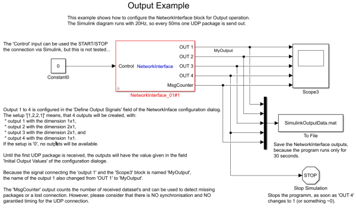

# Network Interface Block for the Soft-Realtime Framework for Simulink

This block enables you, to send or receive data via network connection to your soft-realtime program, generated with the [Soft-Realtime Toolbox](https://github.com/worldwidemv/SimulinkToolchain).

Simple examples are provided in the examples folder, like _examples/test_UDP_ReceiveFromMatlab/_.

## Supported Connections

The block supports both TCP and UDP connections.  
However TCP connections are more error prone and are not well tested.

## Data Format

Since TCP and UDP connections are basic connections types, many clients can be used to send to the block or receive data from the block.  
In any case, the connection uses __little endian__ byte order!

The following data from needs to be implemented in order to communicate with the block:

#### External Client sends data to the Block:

All values send to the block have to be encoded as double (8 bytes) in the following order:

1. id -> fixed value of 333.333
2. counter -> an increasing package counter
3. data length -> the number of double data values in this package
4. data(1) -> first data value, as double
5. data(2) -> second data value, as double
6. ...
10. id -> fixed value of 333.333 to mark the end of the package

An implementation example can be found in _examples/test_UDP_ReceiveFromMatlab/ni_sendData.m_

#### The Block sends data to an External Client:

The block send the meta data as uint16_t / uint32_t, but 
all data values are send as double (8 bytes) values.  

1. id (uint16_t) -> fixed value (size of the blocks input vector)
2. counter (uint32_t) -> an increasing package counter
3. time (double) -> Simulink time when this package was send
4. data length (uint16_t) -> the number of double data values in this package
5. data(1) (double) -> first data value, as double
6. data(2) (double) -> second data value, as double
7. ...
10. id (uint16_t) -> fixed value to mark the end of the package

An implementation example can be found in _examples/test_UDP_SendToMatlab/ni_receiveDataUDP.m_

## Block Parameter

* _Define Input Signals:__ is a vector or 0 with the number and size of the block inputs. E.g. [1,2] will create two inputs, the first of size 1x1 and the second of size 2x1.
* _Define Output Signals:__ is a vector or 0 with the number and size of the block outputs. E.g. [1,2] will create two outputs, the first of size 1x1 and the second of size 2x1.
* _Initial Output Values:_ is a vector or 0 with the output value of the outputs until the first data package is received.
* _Sample Time:_ is the blocks sample time.
* _Use UDP instead of TCP ..._ defines the connection type.
* _Start the network connection at the start of the diagram?_ controls when the network connection is established.
* _Local Port_ is the port, the external client sends it's packages to.
* _Remote IP_ is the IP address f the external client.
* _Remote Port_ is the port, the block sends it's packages to.

### Control Input

The connection can be started and stopped from within the Simulink diagram by setting the _control input_ to:

* 1 = start the connection / network server
* 2 = stop the connection / network server
* any other value = do nothing

However, this feature is experimental and not well tested.